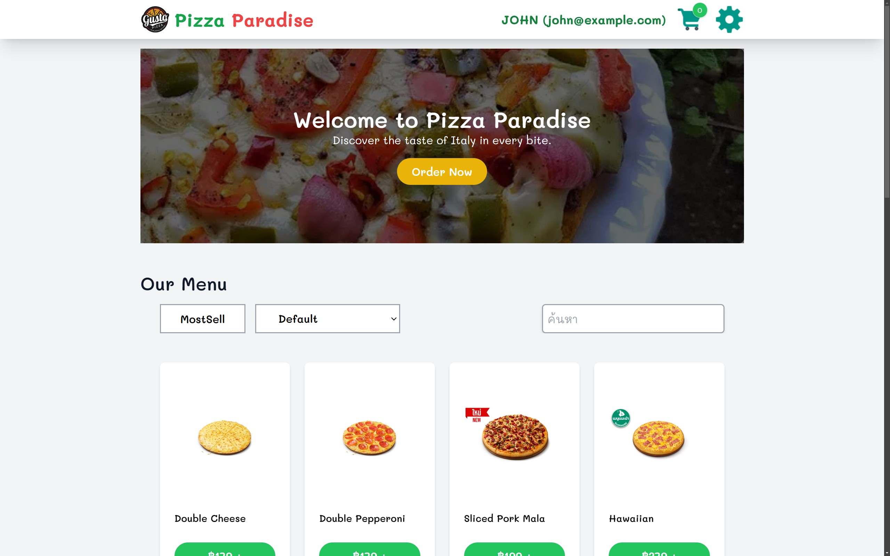
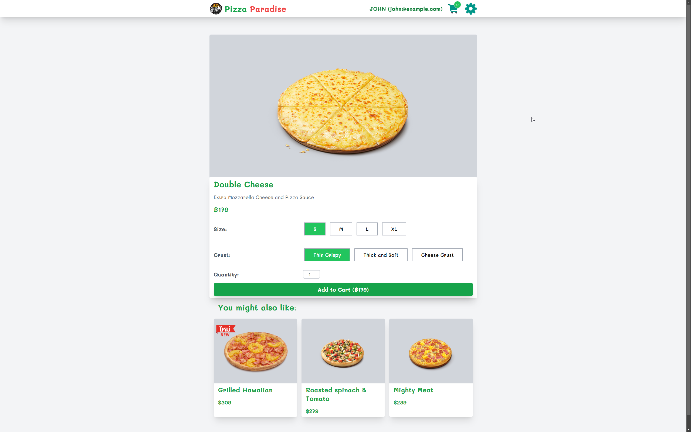
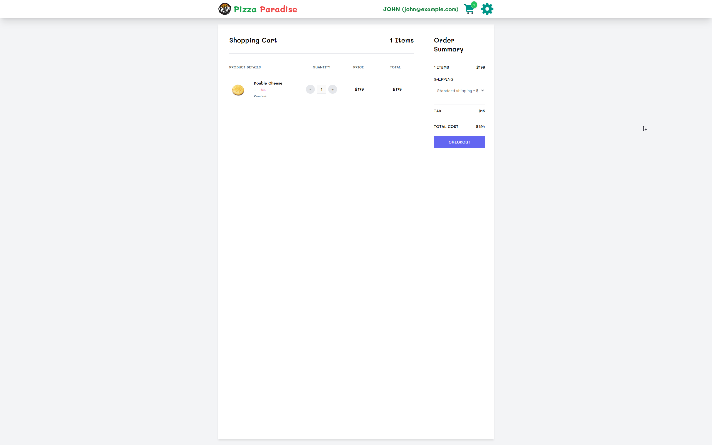
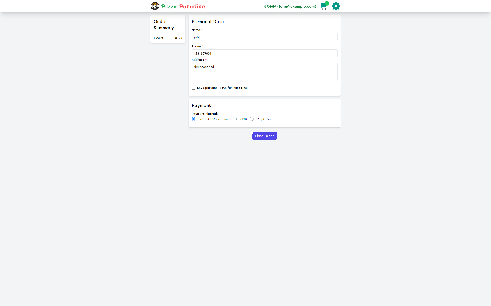
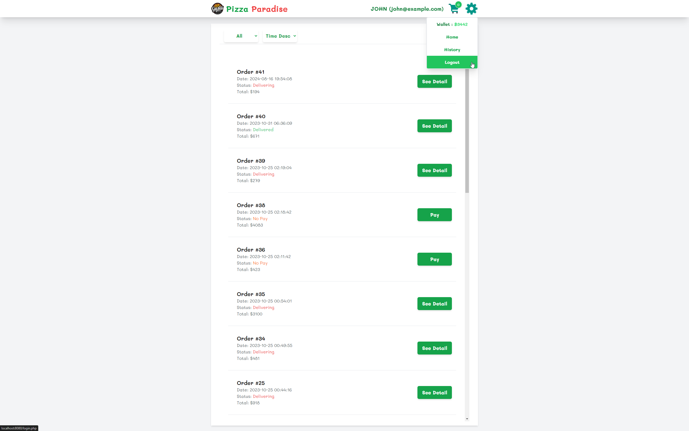
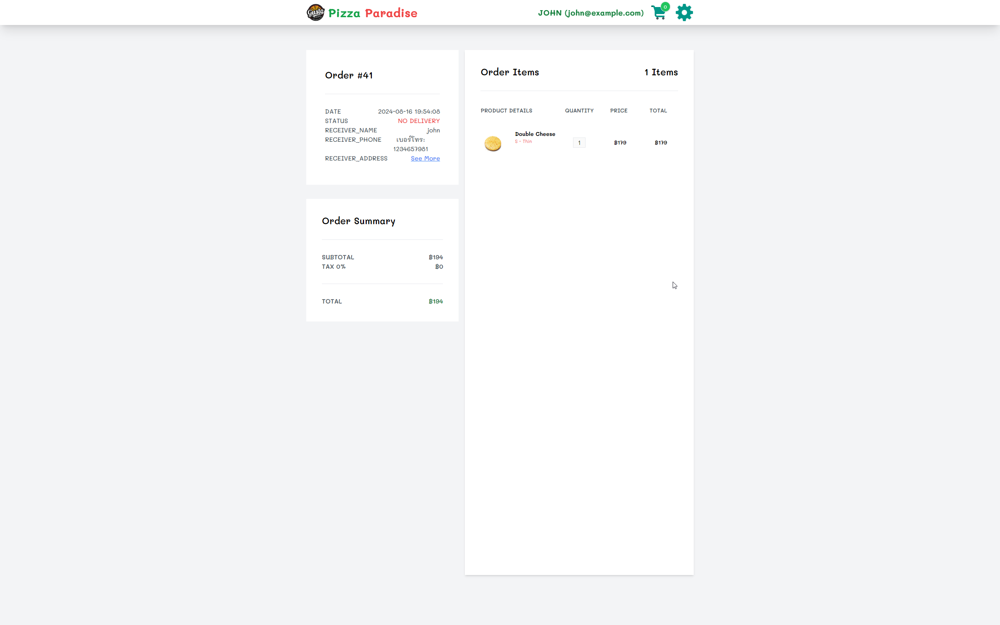
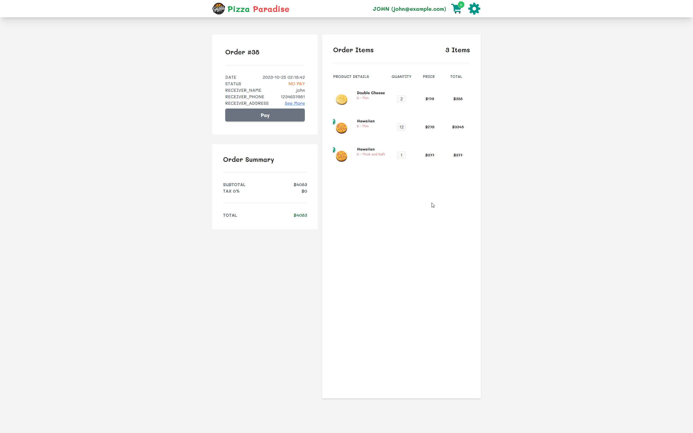
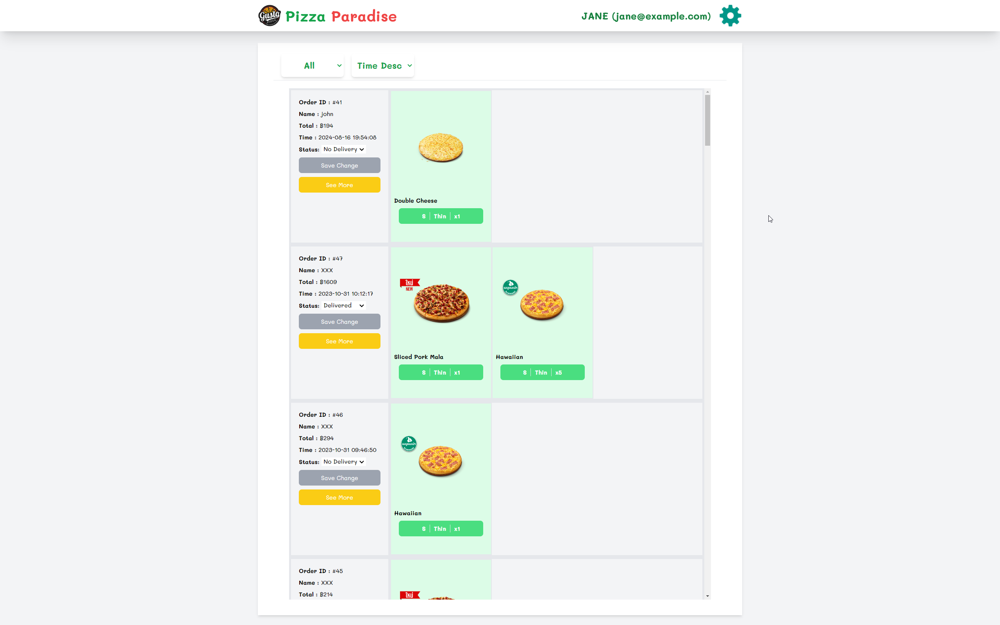

# Pizza Shop Website

This project is a web-based pizza ordering system developed as part of the Web Development course at Mahasarakham University. The website allows users to browse a menu, place orders, and track their order history. It also includes an admin interface for managing the shop.

## Technologies Used

- PHP
- HTML
- JavaScript
- MySQL
- Docker

## Features

1. User Authentication
2. Menu Browsing
3. Shopping Cart
4. Order Placement
5. Payment Processing
6. Order History
7. Admin Dashboard

## Pages

1. User Login
2. User Home
3. Menu
4. Shopping Cart
5. Payment
6. Order History
7. Transaction Details
8. Admin Dashboard

## Page Examples

Below are example images of the various pages in our pizza shop website:

1. User Login
   

2. User Home
   

3. Menu
   

4. Shopping Cart
   

5. Payment
   

6. Order History
   

7. Transaction Details
   
   

8. Admin Dashboard
   

## Setup Instructions

### Using Docker

1. Ensure you have Docker installed on your system.
2. Clone this repository to your local machine.
3. Navigate to the project directory in your terminal.
4. Create a `.env` file in the project root with the following content:
   ```
   DB_SERVERNAME=your_database_server
   DB_NAME=your_database_name
   DB_USER=your_database_user
   DB_PASS=your_database_password
   ```
   Replace the placeholder values with your actual database credentials.
5. Build the Docker image:
   ```
   docker build -t pizzashop .
   ```
6. Run the Docker container:
   ```
   docker run -p 8080:80 --env-file .env pizzashop
   ```
7. Access the website by opening a web browser and navigating to `http://localhost:8080`
8. Go to the website by visiting `http://localhost:8080` in your web browser

Note: Make sure to keep your `.env` file secure and never commit it to version control.

## Acknowledgements

This project was developed as part of the Web Development course at Mahasarakham University.

## License

(Include your chosen license information here)
